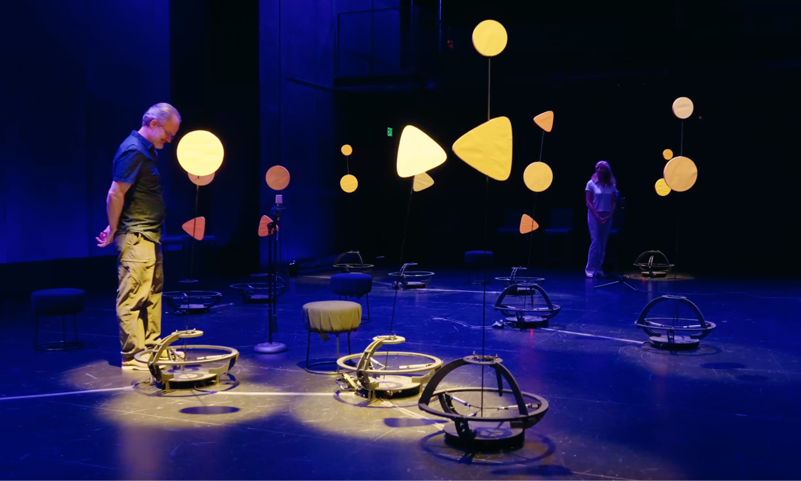

# NeurIPS 2025 Creative AI Track

Credit: Rhythm Bots (2024) by Naomi Ehrich Leonard et al., image courtesy of creativeX.
    

In its third year, the NeurIPS 2025 Creative AI track invites research papers and artworks that explore cutting-edge applications of artificial intelligence and machine learning in art, design, and creative practice.

Focused on the theme of Humanity, this year’s track asks: _what does it mean to be human when we share an increasingly symbiotic relationship with machines that imitate, create, hallucinate, and persuade?_ We welcome submissions from artists, designers, creatives, researchers, and critical thinkers that question and explore:

- How do machines and humans collaborate by playing to their unique strengths?
- What emotional, cultural, or ethical wisdom must we protect or reconsider?
- What new human rituals, responsibilities, or roles will emerge in the new age of AI?
- How do we navigate creativity and agency when authorship is shared and continuously evolving with non‑human entities?
- How does human craft and labor evolve alongside those of machines? And how do we value and reward human skills and creativity while strengthening our social and cultural fabric?
- How will differences in energy consumption between humans and AI impact the way we conceptualise sustainability and choose what is good for the planet in the longer term?
- What principles and values do we imbue in artificial intelligence systems? What are the perils of anthropomorphizing non‑human systems?

Submissions are **not** exclusively limited to the themes above, and we are open to all forms of artwork and research papers that propose original ideas in Creative AI. We particularly encourage work that crosses disciplinary boundaries, and is critical, speculative, poetic, performative, or empirical. This flexibility of formats and the on‑site gathering at NeurIPS will provide a forum for a diversity of voices and lead to engaging discussions that will benefit our community.

## Important Dates:

- June 30: Submission Portal Opens  
- August 2 (Anywhere on Earth): Submission Deadline  
- September 18: Decision  
- October 23: Final Camera‑Ready Submission  

## Call for Papers and Artworks

The [submission portal](https://openreview.net/group?id=NeurIPS.cc/2025/Creative_AI_Track) on OpenReview is open. If you want to sign up quickly but aren’t affiliated with an academic institution, please refer to this [FAQ](https://docs.openreview.net/getting-started/frequently-asked-questions/i-am-an-independent-researcher-how-do-i-sign-up).

### Papers

We invite submissions for research papers that propose original ideas or novel uses of AI and ML for creativity. The topics of research papers are not restricted to the theme of Humanity. Please note that this year the Creative AI track will be part of the NeurIPS conference proceedings and papers will be presented as posters during the conference.

#### _To submit:_
Papers should be 2–6 pages long without references. Use the [template](https://media.neurips.cc/Conferences/NeurIPS2025/Styles.zip) for your submission.

### Artworks

We invite the submission of creative work that showcases innovative use of AI and ML. We encourage authors to consider the theme of Humanity in their work. We invite submissions in all areas of creativity including visual art, music, performing art, film, design, architecture, and more in the format of video recording. 

NeurIPS is a prestigious AI/ML conference that tens of thousands of researchers from academia and industry attend every year. Selected works at the Creative AI track will be presented on large display screens at the conference and the authors will have the opportunity to interact with the NeurIPS research community to germinate more collaborative ideas.

#### _To submit:_
We invite authors to submit their work. An artwork submission requires the following:

- Description (maximum 3 pages in PDF, using provided [template](https://media.neurips.cc/Conferences/NeurIPS2025/Styles.zip)), including:
  - Description of the work and the roles of AI and ML
  - Description on how the theme of Humanity is addressed
  - Short biography of all authors including references to relevant prior works
- Thumbnail image of the work (<100 MB)
- 3‑minute video preview of the work (<100 MB)

### Single‑blind review policy

The names of the authors should be included in the submission.

## Conference policy

If a work is accepted, at least one author must register for the conference and attend in person. For registration policy and registration fee information, visit the [registration page](https://neurips.cc/Register/view-registration).  
The location of the conference is San Diego. Authors are responsible for travel arrangements and expenses. If you need a visa, please refer to the [visa information page](https://neurips.cc/Conferences/2025/Visa). The conference does not provide travel funding and we are working out ways to support artists and exhibitors through other forms of sponsorship.

## Contact

To stay up‑to‑date with announcements, please join our mailing list: [creativeaiml@googlegroups.com](creativeaiml@googlegroups.com).

For other inquiries, use the contact [form](https://neurips.cc/Help/Contact?select=Creative).

Marcelo Coelho / Director, [Design Intelligence Lab](https://designintelligence.mit.edu/) / MIT + Cornell  
Luba Elliott / AI art curator @ [elluba.com](http://elluba.com/)  
Priya Prakash / Designer‑Founder @ [D4SC.io](http://d4sc.io/)  
Yingtao Tian / Sakana AI
